<p align="center">
  <picture>
    <source media="(prefers-color-scheme: dark)" srcset="assets/brand/shale-logo-dark.svg">
    
  </picture>
</p>

<p align="center"><strong>Every agent PR should explain itself.</strong></p>

<p align="center">
  <a href="https://github.com/provasign/shale/actions/workflows/ci.yml"></a>
  <a href="https://github.com/provasign/shale/releases/latest"></a>
  <a href="LICENSE"></a>
</p>

Shale captures what an AI coding agent was asked to do, what it touched, and
what checks it ran — then renders that evidence as a card on the pull request.

**Five minutes to set up. No account. No server. Works across coding agents.**

<p align="center">
  
</p>

## Why

AI coding agents now produce real PR volume. Reviewers still get the same old
diff — usually without the prompt, the session trail, or the local check
history that would explain whether the agent did the right thing.

Shale makes that missing evidence travel with the code. It is **not** a quality
gate, an LLM reviewer, or a hosted attestation service. It is a local-first
recorder and PR renderer:

- **Intent** — what the agent was asked to do, declared by the agent itself.
- **Evidence** — files touched in the session, commands and checks observed,
  model and token metadata when available.
- **Gaps** — changed files with *no* session evidence, sensitive paths,
  tamper warnings. Absence is shown, never hidden.
- **Card** — a neutral PR comment and check that reviewers read before the diff.

The posture is advisory and fail-open everywhere: a Shale bug must never block
your agent, your push, your CI, or your merge.

## Quickstart

```sh
brew install provasign/shale/shale
cd your-repo
shale init
git add . && git commit -m "chore: enable shale" && git push
```

That's it. The next agent-authored PR carries a card. No Homebrew? Grab the
latest [release](https://github.com/provasign/shale/releases/latest) and put
the `shale` binary on your `PATH`.

→ **[Getting started](docs/getting-started.md)** — full walkthrough
→ **[Troubleshooting](docs/troubleshooting.md)** — when something looks off
→ **[Live demo PRs](https://github.com/provasign/shale-test-bed/pulls?q=is%3Apr)** — real cards on real pull requests

## The card

This is an actual card from [a live demo PR](https://github.com/provasign/shale-test-bed/pull/1) — rendered by Shale, unedited:

> ### 🧾 Shale · 1 session · claude-code (claude-fable-5)
> claude-fable-5 · 60k tokens · ~$0.67 · 2 iterations · < 1 min
>
> #### Intent
> > **Add rate limiting to the login endpoint**
> >
> > Token bucket per client IP, 10 requests/min, in-memory. Return 429 with Retry-After. No external deps.
>
> *Declared 2026-06-10 12:54 · session `25f37dfc`*
>
> #### Completion
> > Token-bucket limiter with per-IP keying; 429 + Retry-After on excess. Unit tests cover exhaustion and refill.
>
> #### Changed files (3) — all with session evidence
> | File | Session ID | Notes |
> |---|---|---|
> | `internal/ratelimit/ratelimit.go` | ✅ 25f37dfc | new file |
> | `internal/ratelimit/ratelimit_test.go` | ✅ 25f37dfc | new file |
> | `main.go` | ✅ 25f37dfc | |
>
> #### Checks recorded locally
> | Check | Result | When |
> |---|---|---|
> | `go test ./...` | ✅ passed | 12:54 |
>
> *Advisory — CI is authoritative.*

A PR with **no** evidence gets an explicit no-evidence card instead of
silence, and files changed outside the session are flagged — the card is
honest about what it doesn't know.

## How it works

```text
agent receives task
  → steering prompt asks the agent to declare:  shale intent "…"
  → hooks + CLI record session evidence locally (redacted)
  → agent closes with:  shale done
  → git push runs shale finalize  (evidence committed under .shale/)
  → CI renders the card via the GitHub Action  (API-only, no checkout)
```

`shale init` wires everything in one shot, and everything it writes is
committed — so one person runs it and the whole team is covered on clone:

- steering instructions in `AGENTS.md`, `CLAUDE.md`, `.cursorrules`,
  `.github/copilot-instructions.md`, …
- repo-level capture hooks for Claude Code, VS Code Copilot, Copilot CLI,
  Cursor, and Codex — self-guarding, silently inert for teammates who haven't
  installed Shale
- `.shale/` storage for redacted, schema-versioned evidence
- `.github/workflows/shale.yml` — renders the card on PRs
- a local pre-push hook that finalizes evidence before push

Developers who want machine-wide capture across all repos can run
`shale init --global`.

## Three tiers of evidence

| Tier | Mechanism | Works with |
|---|---|---|
| **Semantic** | The agent calls `shale intent` / `shale done` (steered) | Every agent that can run a shell command |
| **Hook-verified** | Agent hooks stream file touches, commands, prompts to `shale capture` | Claude Code today; Cursor, Codex, Copilot adapters in progress |
| **Git fallback** | `shale finalize` derives the file list from git over the session window | Everything else |

Hooks upgrade card fidelity (✅ per-file verification, transcripts, check
results); they are never required. Without them the card still shows intent,
completion, cost, and git-derived file evidence marked `◐ not hook-verified`.

## Privacy

Evidence lives in your repo, the card renders in your CI with your
`GITHUB_TOKEN` — Shale makes no network calls from your laptop and has no
telemetry, accounts, or server. Agent-authored text (intent, completion
notes, recorded commands) passes a secret-redaction pass before anything is
persisted (`shale init --privacy full|redacted|hash-only`).

**Raw prompt capture is built but switched off.** Shale can also capture the
raw prompts developers type and redact them (secrets, credentials, tokens)
before committing a prompts-only transcript alongside the evidence. We have
**disabled this in the product** — a build-time flag, deliberately not
configurable — until we are confident the redaction layer is strong enough
for free-form human text and the regulatory questions around capturing raw
developer prompts are settled. Today, prompt-derived data never leaves your
laptop: prompts stay in gitignored `.shale/local/`, and only the prompt
count and an intent integrity hash appear in committed evidence.

## Related projects

| Project | Role | License |
|---|---|---|
| **Shale** | Agent PR evidence — this repo | Apache-2.0 |
| [**Prism**](https://github.com/provasign/prism) | Graph-ranked context delivery for coding agents | MIT |
| [**Grove**](https://github.com/provasign/grove) | Persistent code-graph engine (used by Prism, usable directly) | MIT |

## Repository layout

```text
cmd/shale/              CLI entry point
internal/capture/       agent hook payload parsers
internal/store/         .shale read/write, schema versioning, redaction
internal/render/        PR card rendering
internal/forge/         forge API drivers (GitHub today)
action/                 composite GitHub Action
docs/                   getting started, troubleshooting, product doc, spec
```

For contributors:
[product, architecture & design](docs/product.md) ·
[shale file spec](docs/shale-spec.md)

## License

[Apache-2.0](LICENSE)
